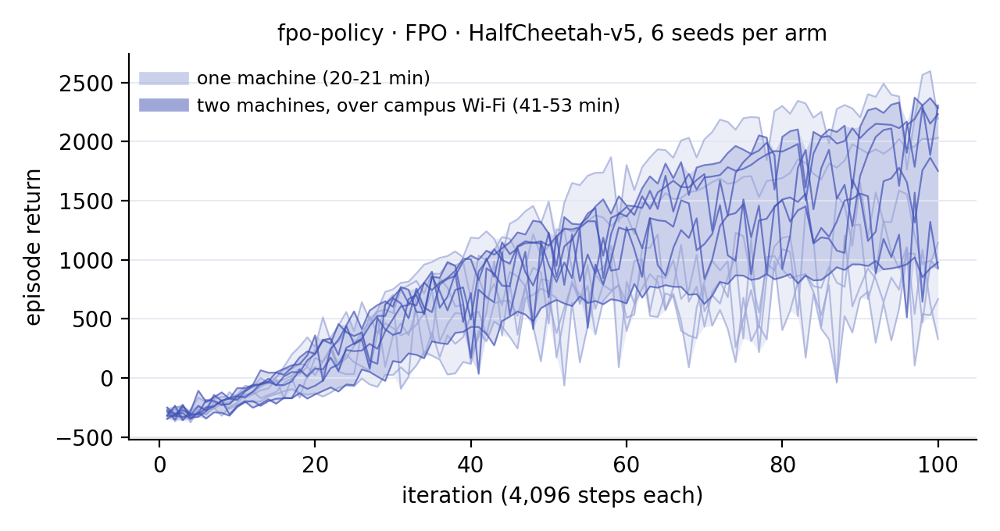

# E43: with its env clients on another physical machine, the cell still learns; crossing costs a fixed latency plus the observation's bytes over the link

2026-09-28 · server on guangzhao (Linux workstation, wired); env clients on
a Windows 11 laptop on Wi-Fi 6, joined by Tailscale peer-to-peer on one
campus network · protocol: [`PROTOCOL.md`](PROTOCOL.md) (`46bce03`, after the
pilot in `results/pilot.txt`, before the registered run) · amendment:
[`AMENDMENT.md`](AMENDMENT.md)

---

## The result

**A. Training.** The coverage figure's `fpo-policy` · FPO · HalfCheetah
cell, with E16's command lines, ran as two arms at once. In the local arm,
servers and env clients were on guangzhao. In the cross arm, the servers
were on guangzhao and the env clients on the laptop. The table gives the mean
return over iterations 91-100 against iteration 1:

| seed | local | cross |
| --- | --- | --- |
| 0 | -293 -> 1,262 (**+1,555**) | -345 -> 2,060 (**+2,405**) |
| 1 | -325 -> 695 (**+1,020**) | -318 -> 2,127 (**+2,445**) |
| 2 | -251 -> 725 (**+976**) | -250 -> 946 (**+1,196**) |

* **P1 holds.** All six seeds logged 100 iterations and five checkpoints,
  with no traceback, and every client exited 0.
* **V1 passes.** The cross clients connected to guangzhao's Tailscale
  address and the local ones to 127.0.0.1. All six servers logged the same
  configuration.
* **P2 and P3 hold.** Both arms learn, 3 of 3 seeds each, against a bar of
  +200.
* **P4 holds.** The cross arm took 1,253, 1,288 and 1,356 s longer from
  iteration 1 to 100, against a predicted 1,119 s ±25%. All three are inside
  the band, but all three sit above the point prediction, by 12-21%.

**B. The boundary's cost**, as the median of five runs of 1,000 exchanges.
Throughput was 20.5, 18.0, 19.6, 15.9 and 14.4 MB/s (median 18.0).

| payload | `lo` | `ts` | `phys` | `phys` predicted |
| --- | --- | --- | --- | --- |
| states only | 0.099 ms | 0.107 ms | 2.82 ms | |
| 48 KiB | 0.161 | 0.172 | 8.01 | 8.28 |
| 184 KiB | 0.293 | 0.306 | 21.38 | 23.72 |
| 588 KiB | 0.947 | 0.700 | 65.80 | 69.72 |

* **V2 passes.** All 60 ladder runs completed.
* **P5 holds.** `lo` and `ts` agree within 0.25 ms at every payload. The
  588 KiB row is the exception in kind, if not in verdict: 0.248 ms apart,
  just inside the tolerance, and with `lo` the slower of the two - as in the
  pilot. That is not explained.
* **P6 holds.** The crossing is a fixed latency plus twice the observation's
  bytes over the link's throughput. Measured is 3-10% under predicted at
  all three payloads.

---

## What crossing costs, and what it is made of

On one machine the boundary is a tenth of a millisecond with states only,
and under a millisecond at 588 KiB. Tailscale adds nothing measurable there:
a machine's own Tailscale address is short-circuited like any local one,
as E7 found for a machine's own Ethernet address.

Between two machines it becomes two terms:
- **A fixed one**: about 2.8 ms here, which is Wi-Fi plus WireGuard plus two
  operating systems.
- **One proportional to size**: each exchange sends the observation twice,
  once in the previous feedback and once in the infer, and both queue on the
  same link. At 18 MB/s that is about 0.11 ms per KiB of observation, more
  than fifty times E7's VM-to-host 2 µs.

A state-only task like this cell pays almost only the fixed term. Per call,
the env client waited 5.0 ms for an action across machines against 2.7 ms
locally. Stepping MuJoCo on the laptop took 0.50 ms against guangzhao's
0.10, and sending feedback 0.41 ms against 0.07. That doubled the wall clock,
from 20 minutes to 41, and changed nothing else; an hour later, with a busier
link and laptop, it was 52 minutes (below).

An image-based policy pays the second term. **This corrects E10**, whose
"1.3-3.6% of a step" used E7's 1.3 ms VM-to-host crossing. Over this link a
184 KiB observation costs 21.4 ms per exchange, which is 21% of the
full-size pi0.5's 100 ms forward. On a faster link the second term shrinks
in proportion to the bandwidth, but no faster link was measured here.

P4's three misses on the high side fit a link that was slowing during the
session: the five throughput runs fell from 20.5 to 14.4 MB/s. This is an
observation, not a test.

---

## The two arms' returns

The registered run left the cross arm's seeds higher: 2,060, 2,127 and 946,
against 1,262, 695 and 725. PROTOCOL.md did not predict that. The two arms
draw from one distribution, so a real gap would have been a defect to find.
[`AMENDMENT.md`](AMENDMENT.md) added seeds 3-5 to both arms, and fixed how
they would be read, before they ran. Iterations 91-100:

| seed | local | cross |
| --- | --- | --- |
| 0 | 1,262 | 2,060 |
| 1 | 695 | 2,127 |
| 2 | 725 | 946 |
| 3 | 1,967 | 2,267 |
| 4 | 2,336 | 1,587 |
| 5 | 857 | 1,082 |
| mean (sd) | 1,307 (694) | 1,678 (564) |

All twelve seeds learn by the status rule. Two of the new local seeds end
above four of the cross seeds, and the means are 371 apart, against a spread
of 694 within the local arm. By the amendment's rule this is seed variation
(`results/amendment.txt`). That is why the figure draws each arm's band, from
its lowest seed to its highest, and no mean line.

The amendment's cross arm also took longer: 1,875-1,985 s more than its local
seeds, against 1,253-1,356 s in the registered run. Two things were slower
an hour later.
- The link: the env clients waited 6.0 ms per call for an action instead of
  5.0.
- The laptop, which was doing other work: stepping MuJoCo took 0.73 ms
  instead of 0.50, and sending feedback 0.56 ms instead of 0.41.

Together that is about 1.4 ms per step, or 570 s over the run, which is the
difference. On a shared Wi-Fi link the crossing's cost is not a constant.

---

## What E43 does not show

* **Any other link, or this one at a steady cost.** Campus Wi-Fi through
  Tailscale is slower than two machines on one wired switch, and it changed
  within the evening (throughput 20.5 down to 14.4 MB/s; per-call wait 5.0
  then 6.0 ms). The model says how the cost scales, but only this link was
  measured.
* **Any other second machine**, or more than one. This is one laptop and
  one server.
* **Image-based training across machines.** The cell sends states. Part B
  measures what images cost on this link; no image policy was trained
  across it.
* **Identical trajectories.** The two machines' MuJoCo differ in the last
  bit from the first step (8.9e-16) and HalfCheetah amplifies it (order 1
  by step 100, `results/pilot.txt`). On one machine a seed reproduces
  exactly. So the arms are compared by the status rule, not trajectory by
  trajectory.
* **Anything about an environment that does not wait.** PlugRL's env client
  stops and waits for each action, so latency slows training without
  changing its data. A robot, or any environment that keeps moving, turns
  latency into a different problem, and E43 does not touch it.

The runs' checkpoints and tensorboards stay on guangzhao. Kept here:
- the logs, of both arms and of the amendment's seeds
- both machines' client summaries
- `ladder.tsv` and `throughput.tsv`
- `curves.json` and `cross-machine.png` (`figure.py`)
- `verdicts.txt` and `summary.tsv` (`summarise.py`)
- `amendment.txt` (`amendment.py`)
