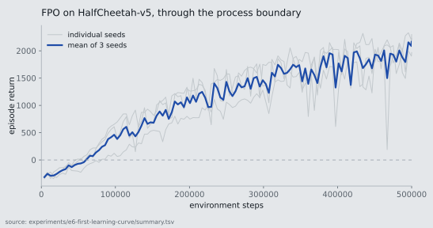

# E6: this project trains a policy, for the first time

2026-09-10 · Windows 11, CPU only (Intel Iris Xe, no NVIDIA GPU, torch
2.7.1+cpu) · plugrl-server @ cb5b369 · plugrl-env-client @ ff9d77e

## In one sentence

FPO on `HalfCheetah-v5`, three seeds, 500,000 environment steps each: episode
return goes from **-315 ± 26** to **1928 ± 224**, in about 100 minutes per
seed on a laptop with no GPU.



The curve is the training return the server logged. The **1928 ± 224** above is
the separate evaluation described below, not this curve's last point.

## Why this needed doing

Nothing in PlugRL had ever trained anything. Before this run:

* every tensorboard file on disk came from `DummyAlgorithm`, whose `learn` is
  a `sleep`; 45 of the 47 contained zero scalars, and the two that were not
  empty held one point each with `rollout/reward = 0.0`;
* **no model weights existed anywhere** in the git history of the four
  repositories;
* of six registered environment families, none could drive either algorithm
  with a real `learn_impl`. There are two, FPO and DPPO. DPPO was out of
  reach for a different reason than the environments: its third-party `dppo`
  module is not installed, so every server log here opens with `Could not
  import DPPO algorithm module for reason: No module named 'dppo'`. That left
  FPO, which needs a continuous-action environment - `classic-v1` is
  discrete-action, `d4rl-v1` does not install on Windows, and the rest need
  assets, a display or a Linux-only stack.

An RL framework that has never produced a learning curve is an assertion. So
this is the smallest run that turns it into a fact.

## Setup

`MuJoCo-v1` was added to `plugrl-env-client` for this, promoted from an
unregistered draft in `examples/`. `HalfCheetah-v5` has a 17-dimensional
observation and a 6-dimensional action, which are exactly
`FPOPolicyConfig`'s defaults (`obs_dim=17`, `action_dim=6`), so the shipped
flow policy points at it with no configuration.

| | |
|---|---|
| Algorithm | FPO, `--algo.buffer-size 4096`, otherwise defaults |
| Policy | `fpo-policy`, 272,423 parameters, `--policy.device cpu` |
| Environment | `HalfCheetah-v5`, one per client process, no rendering |
| Seeds | 0, 1, 2 - each seeding **both** the server (policy init) and the client (environment) |
| Steps | 500,000 per seed |

**`--algo.buffer-size` is the one non-default, and it is not optional.**
`FPOAlgorithm.should_learn()` is true when the rollout buffer is full or when
the run reaches its last step. At the default `buffer_size=983040`, a run of
under a million steps therefore learns **exactly once, at the very end** -
producing a single point rather than a curve. 4096 gives one update per 4096
environment steps, so 500,000 steps is 123 updates.

## Result

| seed | updates | first | final | best | mean of last 10 | wall clock |
|---|---|---|---|---|---|---|
| 0 | 123 | -303.9 | 2298.8 | 2331.4 | 2120.0 | 103 min |
| 1 | 123 | -296.4 | 2231.0 | 2231.0 | 1980.8 | 98 min |
| 2 | 123 | -344.2 | 1970.0 | 2126.3 | 1682.4 | 100 min |

Across seeds. The two ends are not computed the same way: `end` is the mean of
each run's last ten updates, because the curve is noisy near the end; `start`
is each run's first update, a single point.

```
start   -314.8 +/- 25.7    each run's first update
end     1927.7 +/- 223.6   mean of each run's last ten updates
```

Smoothing the start the same way makes it -219.8 +/- 35.5, and the improvement
2147.5 instead of 2242.6 - about 4% smaller. The headline uses the unsmoothed
start; the per-seed table above publishes both inputs, so either can be
recomputed from `summary.tsv`.

`summary.tsv` holds the per-update values for all three seeds; `summarise.py`
regenerates it and prints the curve.

```
step      seed0    seed1    seed2     mean
  4096   -303.9   -296.4   -344.2   -314.8
 40960   -102.4    -96.1   -194.5   -131.0   ###
102400    696.8    393.8     64.5    385.0   ############
204800   1268.9   1497.5    777.2   1181.2   ##########################
307200   1789.8   1049.1    850.2   1229.7   ###########################
409600   2210.5   2033.9   1481.6   1908.7   ######################################
500000   2298.8   2231.0   1970.0   2166.6   ###########################################
```

Seed 2 at step 102,400 is the 64.5 mentioned below - a single bad update, not
a plateau; it is at 777 by 204,800.

### The curve is noisy, and that is worth stating

Single updates swing by more than a thousand. After step 100,000, each seed
still has at least one update far below its trend: 579.9 for seed 0 at step
143,360, 150.8 for seed 1 at 126,976, and 64.5 for seed 2 at 102,400. One
update is 4096 environment steps, about four episodes, so a single unlucky
rollout moves the point a long way. Read the trend, not the points.

## Cross-check: the weights, not just the log

`rollout/reward` is measured during collection, with whatever exploration the
sampler adds. To check that the improvement is in the policy rather than in
the logging, the checkpoint from seed 0 at step 245,760 was loaded into the
`eval` algorithm and run for 5 episodes on **environment seeds it had never
seen** (`--runner.seed 100`).

**Correction, 2026-09-11.** The first version of this section reported a
single evaluation figure of 1339.1. That number had no artefact behind it: no
eval log was committed, the eval invocation was missing from the Reproducing
block, and the checkpoints are gitignored, so nobody - including us - could
check it. It is withdrawn. The evaluation was re-run twice on the surviving
(uncommitted) seed 0 checkpoint, and neither run reproduces it:

| | mean return over 5 episodes | range |
|---|---|---|
| Evaluation re-run 1 | **1656.2** | 1535.7 - 1847.6 |
| Evaluation re-run 2 | **1565.5** | 1485.6 - 1613.7 |
| Training-time value at the same step | 1489.5 | - |

Per-episode returns are in `results/eval-seed0-245760.tsv`, extracted from the
eval run's tensorboard the same way `summary.tsv` is; the two server logs are
`results/eval-seed0-245760-run1.log` and `-run2.log`.

The conclusion survives and is slightly stronger than it was stated: the
checkpoint round-trips, the `eval` path - never previously exercised - works,
and the evaluated policy scores **above** its training-time value, by 5% and
11%, rather than below it.

Two limits on this cross-check, both worth stating. Five episodes is a small
sample: the two re-runs of the *same weights* differ by 6%, which is the same
order as the gap either of them has to the training-time value, so this
supports "the weights learned something" and not a precise number. And the
evaluation is not deterministic - both re-runs used `--seed 0` on the server
and `--runner.seed 100` on the client and still produced different episodes,
so the sampling path has a source of randomness those two seeds do not pin
down.

## What this does and does not support

**Supported:**

* PlugRL trains a policy through its full loop - env client, wire protocol,
  batched inference, feedback channel, learner - and the result is
  reproducible across three seeds on a laptop with no GPU.
* Checkpoints save and load correctly, and a reloaded policy scores in the
  same region as its training log said it did - see the cross-check, which
  puts it 5-11% above, on 5 episodes.
* The measured throughput is 80-86 environment steps per second per run with
  three runs sharing 16 cores. Whole-run `effective_fps` from the client logs
  is 82.1 / 85.9 / 84.6; 500,000 steps over each server's listening-to-
  shutdown wall clock gives 80.3 / 83.9 / 82.8. (Corrected 2026-09-11: this
  bullet previously said 70-83, which no computation over the logs produces.)

**Not supported:**

* Anything about VLAs. This is a 272k-parameter MLP on continuous control.
  The openpi policy path exists in `plugrl-server` and **has never been
  executed**.
* Anything about competitiveness. No baseline was run, no hyperparameter was
  tuned, and HalfCheetah is not a hard benchmark. The claim is "it learns",
  not "it learns well".
* Anything about scale. One environment per client, one client per server,
  one machine. The Ray multi-GPU path cannot run FPO at all - `FPOAlgorithm`
  is not a `DDPAlgorithm`.
* Anything about what the three concurrent runs cost each other. No solo
  benchmark was run. (Corrected 2026-09-11: this document previously claimed
  "about 140 [steps/s] with one run alone", implying contention roughly halved
  throughput. The logs do not support that and point the other way. The only
  single-run data is seed 0's first 21 minutes, before seed 1's server came up
  at 21:42:20: 79,781 steps in the 1,228 s from client start to its last
  timing line at 21:41:56, an average of 65 steps/s, and the client's own
  cumulative `effective_fps` reads 65.97 there. 140 is only its first
  30-second window - 142.8, followed immediately by 117.0, 105.9 and 54.4 -
  and the cumulative `effective_fps` decays from 162.15 to 65.97 across that
  solo stretch. The same run then averaged 85 steps/s over the 30-second
  windows of the rest of its life, with the other two seeds running - faster,
  not slower. Why is not established here, so the honest statement is that
  this experiment did not measure contention.)

## Reproducing

```bash
bash run.sh                    # 3 seeds x 500k steps, about 100 min each
bash run.sh 40000              # a 5-minute version that still shows the trend
python summarise.py            # regenerate summary.tsv and print the curve
```

**`run.sh` as committed runs the three seeds serially** - the client runs in
the foreground of a `for seed in $SEEDS` loop, so seed N+1 cannot start until
seed N finishes. The runs in `results/` were not produced that way: all three
servers were alive together from 21:42 to 23:05 (seed 0 listening 21:21:27,
seed 1 21:42:20, seed 2 21:42:35). So the committed script reproduces the
learning curve, which is the result, but not the conditions the throughput
figures were measured under. The parallel launcher that was actually used was
not kept.

The evaluation in the cross-check section is a separate two-process run, not
part of `run.sh`. Server:

```bash
python -m plugrl_server.cli fpo-policy default eval default \
    --port "$PORT" --seed 0 --policy.device cpu \
    --algo.policy-checkpoint-path "$RESULTS/fpo/fpo-policy/halfcheetah-seed0/245760" \
    --algo.num-episodes 5 --no-show-progress-bar \
    --checkpoint-base-dir "$OUT" --exp-name eval-seed0-245760 --overwrite
```

Client, against the same port:

```bash
python -m plugrl_env_client.cli mujoco-v1 \
    --server-port "$PORT" --server-host 127.0.0.1 \
    --num-envs 1 --num-episodes 5 \
    --runner.replan-steps 1 --runner.seed 100
```

Re-run 1 used `$PORT=8700` and also passed `--no-show-metric-table`; re-run 2
used 8701. The episode returns do not appear in either log - they are written
to the eval run's tensorboard, which is why the per-episode table is extracted
to `eval-seed0-245760.tsv`.

`run.sh` finds both interpreters itself and checks they can import what they
need before starting; `PLUGRL_SERVER_PYTHON`, `PLUGRL_CLIENT_PYTHON` and
`PLUGRL_ENV_CLIENT` override the guesses. Checkpoints and tensorboard files
are not committed - `summary.tsv` and `eval-seed0-245760.tsv` are the results.
The server and client logs are. **The eval command above therefore cannot be
run against this repository as checked out**: it needs the step-245,760
checkpoint, which is gitignored, so reproducing it means re-training seed 0
first.

## A note on how these runs ended

All three jobs reported a non-zero exit code while their data was complete
and their servers had shut down cleanly. The cause was editing `run.sh` while
it was executing: bash reads a script incrementally, so changing it shifted
the byte offsets under the running interpreter and it resumed at the wrong
place, reporting `unexpected EOF` after the loop had finished. The runs
themselves were unaffected, which the logs and the 123 updates per seed
confirm - but a non-zero exit deserves an explanation rather than a shrug.
